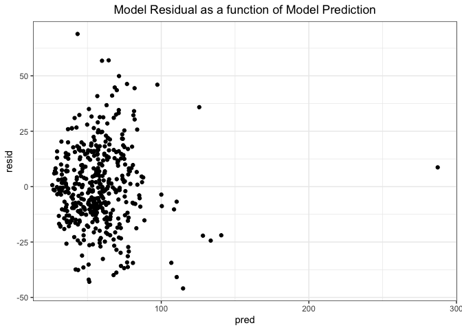
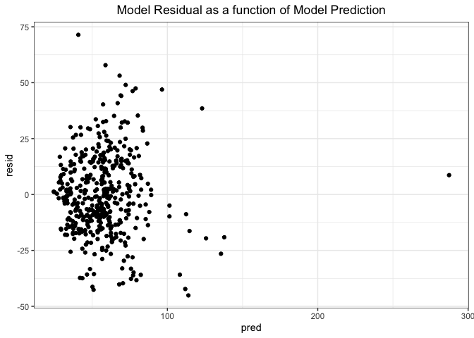
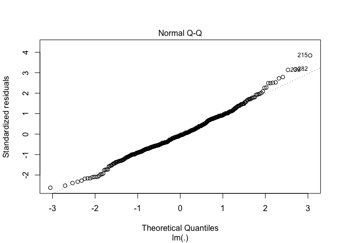
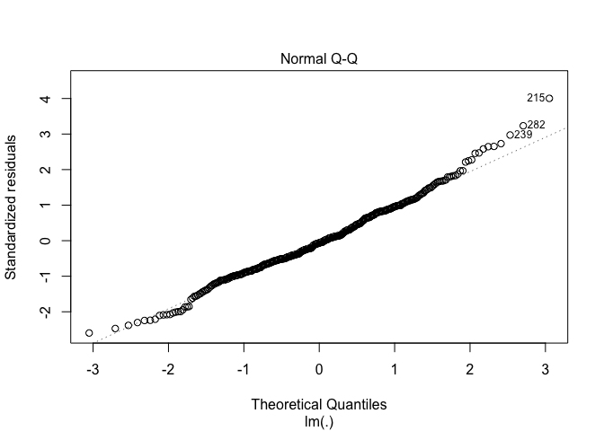

p8130\_final\_project\_BG
================
Benjamin Goebel
12/14/2021

Let’s define helpful functions.

``` r
# Functions

# Purpose: Calculates the Pearson's correlation coefficient between every
# variable in the data set and a specified variable.
# Arguments: v_name: a variable of type character that is the variable name
# Returns: A knitted table of correlations.
get_cor_by_var <- function(v_name) {
  cdi %>%
  map(~cor(as.numeric(.x), pull(cdi, v_name), method = "pearson")) %>%
  as_tibble() %>%
  pivot_longer(id:log_pop_density,
               names_to = "variables",
               values_to = "r") %>%
  mutate(
    sign = ifelse(r < 0, "-", "+"),
    r = abs(r)
  ) %>%
  arrange(desc(r)) %>%
  knitr::kable()
}

# Purpose: Fits the model and gets the model adjusted r-squared.
# Arguments: mod: a variable of type character that is the formula to fit a 
#            linear model.
# Returns: A numeric, the model adjusted r-squared.
get_mod_adj_r_squared <- function(mod) {
  lm(mod, data = cdi) %>%
  broom::glance() %>%
  pull(adj.r.squared)
}

# Purpose: Performs cross validation on a model specified by its formula.
# Arguments: mod: a variable of type character that is the formula to fit a 
#            linear model.
# Returns: A numeric, the model root mean squared error.
get_cv_rmse <- function(mod) {
  set.seed(1)
  crossv_mc(cdi, 1000) %>%
  mutate(
    train = map(train, as_tibble),
    test = map(test, as_tibble)
  ) %>%
  mutate(
    fitted_mod = map(train, ~lm(mod, data = .x))
  ) %>%
  mutate(
    rmse_mod = map2_dbl(fitted_mod, test, ~rmse(model = .x, data = .y))
  ) %>%
  pull(rmse_mod) %>%
  mean()
}

# Purpose: Fits model.
#          Plots model residual as a function of model prediction for the given
#          model formula.
# Arguments: mod: a variable of type character that is the formula to fit a 
#            linear model.
# Returns: The ggplot.
plot_model_residuals <- function(mod) {
  fitted_mod <- lm(mod, data = cdi) 
  cdi %>%
  add_predictions(fitted_mod) %>%
  add_residuals(fitted_mod) %>%
  ggplot(aes(x = pred, y = resid)) +
  geom_point() +
  theme_bw() +
  labs(
    title = "Model Residual as a function of Model Prediction"
  ) +
  theme(plot.title = element_text(hjust = 0.5))
}

# Purpose: Fits the specified model and creates a QQ Plot.
# Arguments: mod: a variable of type character that is the formula to fit a 
#            linear model.
# Returns: The plot.
plot_mod_qq <- function(mod) {
  mod %>%
  lm(data = cdi) %>%
  plot(which = 2)
}
```

Let’s begin by reading in the data and adding a column for the crime
rate per 1,000 people in the county population. We will name this column
`CRM_1000`. We will then recode the region variable as a factor.

``` r
cdi <- read_csv(here::here("data", "cdi.csv")) %>%
  mutate(CRM_1000 = (crimes/pop) * 1000,
         region = as.factor(region),
         region = fct_recode(region, "northeast" = "1", "north_central" = "2",
                             "south" = "3", "west" = "4"),
         pop_density = pop/area,
         log_pop18 = log(pop18),
         log_poverty = log(poverty),
         log_totalinc = log(totalinc),
         log_pcincome = log(pcincome),
         log_pop_density = log(pop_density))
```

Let’s calculate the Pearson’s correlation coefficient between every
variable in the data set and `CRM_1000`.

``` r
get_cor_by_var("CRM_1000")
```

| variables         |         r | sign |
|:------------------|----------:|:-----|
| CRM\_1000         | 1.0000000 | \+   |
| crimes            | 0.5300430 | \+   |
| log\_poverty      | 0.4823623 | \+   |
| pop\_density      | 0.4804285 | \+   |
| poverty           | 0.4718442 | \+   |
| beds              | 0.3915167 | \+   |
| id                | 0.3756659 | \-   |
| region            | 0.3427584 | \+   |
| log\_pop\_density | 0.3367361 | \+   |
| log\_totalinc     | 0.3273042 | \+   |
| docs              | 0.3075291 | \+   |
| pop               | 0.2800992 | \+   |
| totalinc          | 0.2281557 | \+   |
| hsgrad            | 0.2264129 | \-   |
| log\_pop18        | 0.2039079 | \+   |
| pop18             | 0.1905688 | \+   |
| pcincome          | 0.0802442 | \-   |
| log\_pcincome     | 0.0695287 | \-   |
| pop65             | 0.0665333 | \-   |
| area              | 0.0429484 | \+   |
| unemp             | 0.0418466 | \+   |
| bagrad            | 0.0383046 | \+   |
| cty               |        NA | NA   |
| state             |        NA | NA   |

Now, let’s define models of interest.

``` r
# Define model formulas and put in a list
fit13 <- "CRM_1000 ~ region + log_pop_density + log_totalinc + log_pop18 + log_poverty"
fit14 <- "CRM_1000 ~ log_pop_density + region + log_poverty + log_pcincome"
fit15 <- "CRM_1000 ~ log_pop_density + region + log_poverty + log_totalinc"

model_list <-  
  list(
    f13 = fit13,
    f14 = fit14,
    f15 = fit15
  )
```

Here is each model’s adjusted R-squared value.

``` r
# Get each model's adjusted r-squared
map(model_list, get_mod_adj_r_squared) %>%
  as_tibble() %>%
  pivot_longer(f13:f15,
               names_to = "model",
               values_to = "adj_r_squared") %>%
  arrange(desc(adj_r_squared)) %>%
  knitr::kable()
```

| model | adj\_r\_squared |
|:------|----------------:|
| f13   |       0.5370508 |
| f15   |       0.5314421 |
| f14   |       0.5283651 |

Here is each model’s root mean squared error.

``` r
# Perform cross validation for each model
map(model_list, get_cv_rmse) %>%
  as_tibble() %>%
  pivot_longer(f13:f15,
               names_to = "model",
               values_to = "RMSE") %>%
  arrange(RMSE) %>%
  knitr::kable()
```

| model |     RMSE |
|:------|---------:|
| f13   | 18.51358 |
| f15   | 18.59996 |
| f14   | 18.67414 |

Further, we can plot the model residuals as a function of the model
predictions.

``` r
plot_model_residuals(fit13)
```

<!-- -->

``` r
plot_model_residuals(fit14)
```

<!-- -->

``` r
plot_model_residuals(fit15)
```

<!-- -->

QQ plots

``` r
plot_mod_qq(fit13)
```

<!-- -->

``` r
plot_mod_qq(fit14)
```

<!-- -->

``` r
plot_mod_qq(fit15)
```

<!-- -->
