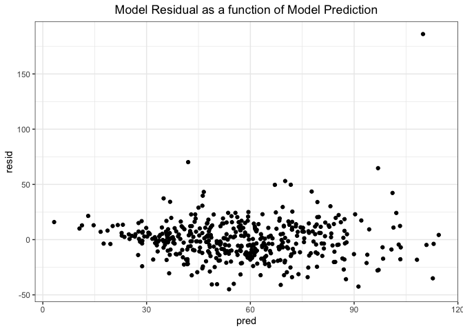
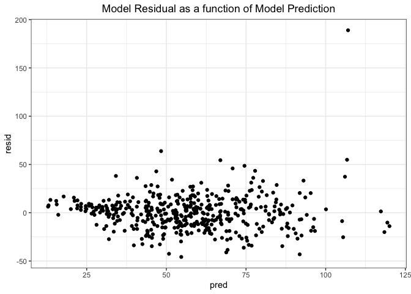
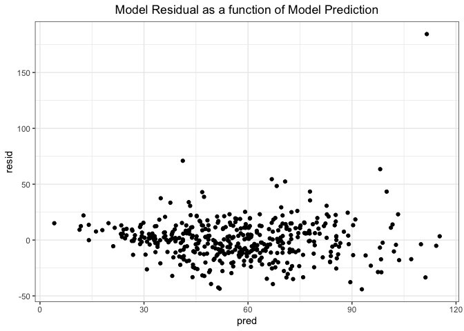
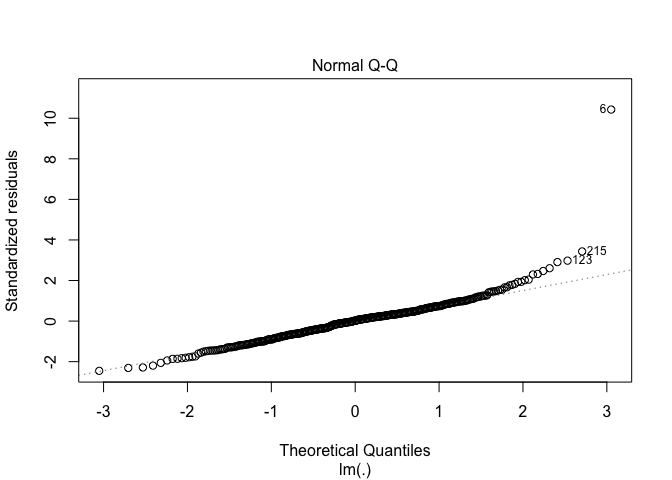
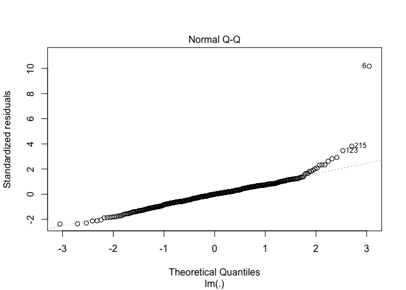

p8130\_final\_project\_BG
================
Benjamin Goebel
12/14/2021

Let’s define helpful functions.

``` r
# Functions

# Purpose: Calculates the Pearson's correlation coefficient between every
# variable in the data set and a specified variable.
# Arguments: v_name: a variable of type character that is the variable name
# Returns: A knitted table of correlations.
get_cor_by_var <- function(v_name) {
  cdi %>%
  map(~cor(as.numeric(.x), pull(cdi, v_name), method = "pearson")) %>%
  as_tibble() %>%
  pivot_longer(id:pop_density,
               names_to = "variables",
               values_to = "r") %>%
  mutate(
    sign = ifelse(r < 0, "-", "+"),
    r = abs(r)
  ) %>%
  arrange(desc(r)) %>%
  knitr::kable()
}

# Purpose: Fits the model and gets the model adjusted r-squared.
# Arguments: mod: a variable of type character that is the formula to fit a 
#            linear model.
# Returns: A numeric, the model adjusted r-squared.
get_mod_adj_r_squared <- function(mod) {
  lm(mod, data = cdi) %>%
  broom::glance() %>%
  pull(adj.r.squared)
}

# Purpose: Performs 5-fold cross validation on a model specified by its formula.
# Arguments: mod: a variable of type character that is the formula to fit a 
#            linear model.
# Returns: A numeric, the model root mean squared error.
get_cv_rmse <- function(mod) {
  crossv_kfold(cdi, k = 5) %>%
  mutate(
    train = map(train, as_tibble),
    test = map(test, as_tibble)
  ) %>%
  mutate(
    fitted_mod = map(train, ~lm(mod, data = .x))
  ) %>%
  mutate(
    rmse_mod = map2_dbl(fitted_mod, test, ~rmse(model = .x, data = .y))
  ) %>%
  pull(rmse_mod) %>%
  mean()
}

# Purpose: Fits model.
#          Plots model residual as a function of model prediction for the given
#          model formula.
# Arguments: mod: a variable of type character that is the formula to fit a 
#            linear model.
# Returns: The ggplot.
plot_model_residuals <- function(mod) {
  fitted_mod <- lm(mod, data = cdi) 
  cdi %>%
  add_predictions(fitted_mod) %>%
  add_residuals(fitted_mod) %>%
  ggplot(aes(x = pred, y = resid)) +
  geom_point() +
  theme_bw() +
  labs(
    title = "Model Residual as a function of Model Prediction"
  ) +
  theme(plot.title = element_text(hjust = 0.5))
}

# Purpose: Fits the specified model and creates a QQ Plot.
# Arguments: mod: a variable of type character that is the formula to fit a 
#            linear model.
# Returns: The plot.
plot_mod_qq <- function(mod) {
  mod %>%
  lm(data = cdi) %>%
  plot(which = 2)
}
```

Let’s begin by reading in the data and adding a column for the crime
rate per 1,000 people in the county population. We will name this column
`CRM_1000`. We will then recode the region variable as a factor.

``` r
cdi <- read_csv(here::here("data", "cdi.csv")) %>%
  mutate(CRM_1000 = (crimes/pop) * 1000,
         region = as.factor(region),
         region = fct_recode(region, "northeast" = "1", "north_central" = "2",
                             "south" = "3", "west" = "4"),
         pop_density = pop/area)
```

Let’s calculate the Pearson’s correlation coefficient between every
variable in the data set and `CRM_1000`.

``` r
get_cor_by_var("CRM_1000")
```

| variables    |         r | sign |
|:-------------|----------:|:-----|
| CRM\_1000    | 1.0000000 | \+   |
| crimes       | 0.5300430 | \+   |
| pop\_density | 0.4804285 | \+   |
| poverty      | 0.4718442 | \+   |
| beds         | 0.3915167 | \+   |
| id           | 0.3756659 | \-   |
| region       | 0.3427584 | \+   |
| docs         | 0.3075291 | \+   |
| pop          | 0.2800992 | \+   |
| totalinc     | 0.2281557 | \+   |
| hsgrad       | 0.2264129 | \-   |
| pop18        | 0.1905688 | \+   |
| pcincome     | 0.0802442 | \-   |
| pop65        | 0.0665333 | \-   |
| area         | 0.0429484 | \+   |
| unemp        | 0.0418466 | \+   |
| bagrad       | 0.0383046 | \+   |
| cty          |        NA | NA   |
| state        |        NA | NA   |

Now, let’s define models of interest.

``` r
# Define model formulas and put in a list
fit1 <- "CRM_1000 ~ pop_density + region + poverty + pcincome + poverty*pop_density"
fit2 <- "CRM_1000 ~ pop_density + poverty"
fit3 <- "CRM_1000 ~ pop_density + poverty + region"
fit4 <- "CRM_1000 ~ pop_density + poverty + region + totalinc"
fit5 <- "CRM_1000 ~ pop_density + poverty + region + pcincome"
fit6 <- "CRM_1000 ~ pop_density + poverty + region + pcincome + area"
fit7 <- str_c("CRM_1000 ~ pop_density + region + poverty + pcincome + ", 
              "region*poverty + region*pcincome")
fit8 <- str_c("CRM_1000 ~ pop_density + region + poverty + pcincome + ",
              "poverty*pop_density + region*pcincome")
fit9 <- str_c("CRM_1000 ~ pop_density + region + poverty + pcincome + ",
              "poverty*pop_density + region*pcincome + poverty*pcincome")
fit10 <- str_c("CRM_1000 ~ pop_density + region + poverty + pcincome + hsgrad + ",
              "poverty*pop_density + region*pcincome")
fit11 <- str_c("CRM_1000 ~ pop_density + region + poverty + pcincome + hsgrad +",
               "poverty*pop_density")

model_list <-  
  list(
    f1 = fit1,
    f2 = fit2,
    f3 = fit3,
    f4 = fit4,
    f5 = fit5,
    f6 = fit6,
    f7 = fit7,
    f8 = fit8,
    f9 = fit9,
    f10 = fit10,
    f11 = fit11
  )
```

Here is each model’s adjusted R-squared value.

``` r
# Get each model's adjusted r-squared
map(model_list, get_mod_adj_r_squared) %>%
  as_tibble() %>%
  pivot_longer(f1:f11,
               names_to = "model",
               values_to = "adj_r_squared") %>%
  arrange(desc(adj_r_squared)) %>%
  knitr::kable()
```

| model | adj\_r\_squared |
|:------|----------------:|
| f9    |       0.6151601 |
| f11   |       0.5648881 |
| f10   |       0.5640484 |
| f1    |       0.5618281 |
| f8    |       0.5612370 |
| f7    |       0.5416761 |
| f6    |       0.5321478 |
| f5    |       0.5318993 |
| f4    |       0.5316251 |
| f3    |       0.5205424 |
| f2    |       0.3998009 |

Here is each model’s root mean squared error.

``` r
# Perform 5-fold cross validation for each model
map(model_list, get_cv_rmse) %>%
  as_tibble() %>%
  pivot_longer(f1:f11,
               names_to = "model",
               values_to = "RMSE") %>%
  arrange(RMSE) %>%
  knitr::kable()
```

| model |     RMSE |
|:------|---------:|
| f9    | 17.85671 |
| f1    | 18.43948 |
| f10   | 18.49985 |
| f11   | 18.58657 |
| f8    | 18.71275 |
| f3    | 19.48425 |
| f7    | 19.51368 |
| f5    | 19.61322 |
| f4    | 19.63314 |
| f6    | 19.73872 |
| f2    | 21.46336 |

Further, we can plot the model residuals as a function of the model
predictions.

``` r
plot_model_residuals(fit1)
```

<!-- -->

``` r
plot_model_residuals(fit8)
```

<!-- -->

``` r
plot_model_residuals(fit11)
```

<!-- -->

QQ plots

``` r
plot_mod_qq(fit1)
```

<!-- -->

``` r
plot_mod_qq(fit8)
```

<!-- -->

``` r
plot_mod_qq(fit11)
```

<!-- -->
