p8130\_final\_project\_BG\_JA
================
Benjamin Goebel, Jesse Ames
12/14/2021

Let’s define helpful functions.

``` r
# Functions

# Purpose: Calculates the Pearson's correlation coefficient between every
# variable in the data set and a specified variable.
# Arguments: v_name: a variable of type character that is the variable name
# Returns: A knitted table of correlations.
get_cor_by_var <- function(v_name) {
  cdi %>%
  map(~cor(as.numeric(.x), pull(cdi, v_name), method = "pearson")) %>%
  as_tibble() %>%
  pivot_longer(CRM_1000:log_docbed,
               names_to = "variables",
               values_to = "r") %>%
  mutate(
    sign = ifelse(r < 0, "-", "+"),
    r = abs(r)
  ) %>%
  arrange(desc(r)) %>%
  knitr::kable()
}

# Purpose: Fits the model and gets the model adjusted r-squared.
# Arguments: mod: a variable of type character that is the formula to fit a 
#            linear model.
# Returns: A numeric, the model adjusted r-squared.
get_mod_adj_r_squared <- function(mod, data = cdi) {
  lm(mod, data = data) %>%
  broom::glance() %>%
  pull(adj.r.squared)
}

# Purpose: Performs cross validation on a model specified by its formula.
# Arguments: mod: a variable of type character that is the formula to fit a 
#            linear model.
# Returns: A column vector of the model root mean squared errors generated by the validation procedure.
get_cv_rmse <- function(mod, data = cdi) {
  set.seed(1)
  crossv_mc(data, 1000) %>%
  mutate(
    train = map(train, as_tibble),
    test = map(test, as_tibble)
  ) %>%
  mutate(
    fitted_mod = map(train, ~lm(mod, data = .x))
  ) %>%
  mutate(
    rmse_mod = map2_dbl(fitted_mod, test, ~rmse(model = .x, data = .y))
  ) %>%
  pull(rmse_mod)
}

# Purpose: Fits model.
#          Plots model residual as a function of model prediction for the given
#          model formula.
# Arguments: mod: a variable of type character that is the formula to fit a 
#            linear model.
# Returns: The ggplot.
plot_model_residuals <- function(mod, data = cdi) {
  fitted_mod <- lm(mod, data = data) 
  cdi %>%
  add_predictions(fitted_mod) %>%
  add_residuals(fitted_mod) %>%
  ggplot(aes(x = pred, y = resid)) +
  geom_point() +
  theme_bw() +
  labs(
    title = "Model Residual as a function of Model Prediction"
  ) +
  theme(plot.title = element_text(hjust = 0.5))
}

# Purpose: Fits the specified model and creates a QQ Plot.
# Arguments: mod: a variable of type character that is the formula to fit a 
#            linear model.
# Returns: The plot.
plot_mod_qq <- function(mod, data = cdi) {
  mod %>%
  lm(data = data) %>%
  plot(which = 2)
}


# Purpose: Fits the specified model and creates a leverage plot.
# Arguments: mod: a variable of type character that is the formula to fit a 
#            linear model.
# Returns: The plot.
plot_mod_leverage <- function(mod, data = cdi) {
  mod %>%
  lm(data = data) %>%
  plot(which = 5)
}
```

Let’s begin by reading in the data and adding a column for the crime
rate per 1,000 people in the county population. We will name this column
`CRM_1000`. We will then recode the region variable as a factor.

``` r
cdi <- read_csv(here::here("data", "cdi.csv")) %>%
  mutate(CRM_1000 = (crimes/pop) * 1000,
         state = as.factor(state),
         region = as.factor(region),
         region = fct_recode(region, "Northeast" = "1", "North Central" = "2",
                             "South" = "3", "West" = "4"),
         pop_density = pop/area,
         docbed = docs/beds,
         log_pop18 = log(pop18),
         log_pop65 = log(pop65),
         log_hsgrad = log(hsgrad),
         log_bagrad = log(bagrad),
         log_poverty = log(poverty),
         log_unemp = log(unemp),
         log_totalinc = log(totalinc),
         log_pcincome = log(pcincome),
         log_pop_density = log(pop_density),
         log_docbed = log(docbed)
         ) %>% 
  dplyr::select(-id, -cty, -docs, -beds, -crimes, -pop, -area) %>% 
  dplyr::select(CRM_1000, state, region, everything())
```

Let’s calculate the Pearson’s correlation coefficient between every
variable in the data set and `CRM_1000`.

``` r
get_cor_by_var("CRM_1000")
```

| variables         |         r | sign |
|:------------------|----------:|:-----|
| CRM\_1000         | 1.0000000 | \+   |
| log\_poverty      | 0.4823623 | \+   |
| pop\_density      | 0.4804285 | \+   |
| poverty           | 0.4718442 | \+   |
| region            | 0.3427584 | \+   |
| log\_pop\_density | 0.3367361 | \+   |
| log\_totalinc     | 0.3273042 | \+   |
| totalinc          | 0.2281557 | \+   |
| hsgrad            | 0.2264129 | \-   |
| log\_hsgrad       | 0.2260266 | \-   |
| log\_pop18        | 0.2039079 | \+   |
| pop18             | 0.1905688 | \+   |
| state             | 0.0881015 | \-   |
| pcincome          | 0.0802442 | \-   |
| log\_pcincome     | 0.0695287 | \-   |
| pop65             | 0.0665333 | \-   |
| log\_bagrad       | 0.0632119 | \+   |
| log\_pop65        | 0.0543376 | \-   |
| docbed            | 0.0432661 | \-   |
| unemp             | 0.0418466 | \+   |
| bagrad            | 0.0383046 | \+   |
| log\_unemp        | 0.0362602 | \+   |
| log\_docbed       | 0.0244917 | \+   |

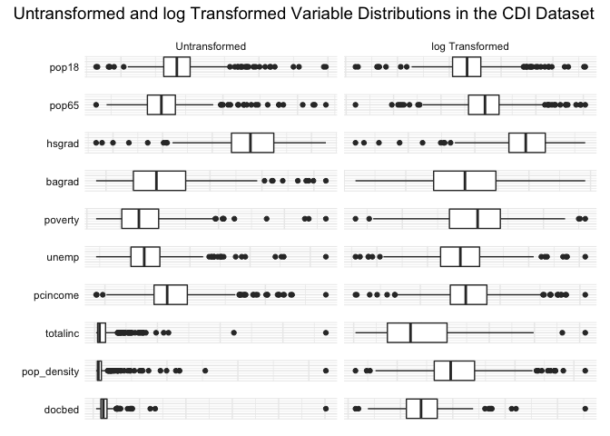<!-- -->

<!-- -->

``` r
# keep only the predictors needed to build the model using pcincome as income measure
pcincome_model = 
  cdi %>% 
  dplyr::select(-c(pop18, pop65, bagrad, poverty, unemp, pcincome, totalinc, log_totalinc, docbed, pop_density, log_hsgrad, state))

# get first full mlr
fit_1 = lm(CRM_1000 ~ ., data = pcincome_model)
## summary(fit_1) # aRs = 0.5309
## boxcox(fit_1) # we ignore the square root tranformation for a more sensible interpretation

# run stepwise and get a list of highly effective predictors
step(fit_1, direction = 'both')
```

    ## Start:  AIC=2590.75
    ## CRM_1000 ~ region + hsgrad + log_pop18 + log_pop65 + log_bagrad + 
    ##     log_poverty + log_unemp + log_pcincome + log_pop_density + 
    ##     log_docbed
    ## 
    ##                   Df Sum of Sq    RSS    AIC
    ## - hsgrad           1      11.1 149615 2588.8
    ## - log_pop65        1      25.9 149630 2588.8
    ## - log_docbed       1      47.3 149651 2588.9
    ## - log_bagrad       1      67.3 149671 2588.9
    ## - log_unemp        1     155.9 149760 2589.2
    ## <none>                         149604 2590.8
    ## - log_pop18        1     871.6 150476 2591.3
    ## - log_pcincome     1    4540.0 154144 2601.9
    ## - log_pop_density  1   18002.3 167607 2638.7
    ## - region           3   23895.7 173500 2649.9
    ## - log_poverty      1   28424.7 178029 2665.3
    ## 
    ## Step:  AIC=2588.78
    ## CRM_1000 ~ region + log_pop18 + log_pop65 + log_bagrad + log_poverty + 
    ##     log_unemp + log_pcincome + log_pop_density + log_docbed
    ## 
    ##                   Df Sum of Sq    RSS    AIC
    ## - log_pop65        1        25 149641 2586.9
    ## - log_docbed       1        44 149659 2586.9
    ## - log_bagrad       1        58 149673 2586.9
    ## - log_unemp        1       172 149787 2587.3
    ## <none>                         149615 2588.8
    ## - log_pop18        1       888 150504 2589.4
    ## + hsgrad           1        11 149604 2590.8
    ## - log_pcincome     1      4741 154356 2600.5
    ## - log_pop_density  1     18162 167778 2637.2
    ## - region           3     24109 173724 2648.5
    ## - log_poverty      1     36605 186221 2683.1
    ## 
    ## Step:  AIC=2586.86
    ## CRM_1000 ~ region + log_pop18 + log_bagrad + log_poverty + log_unemp + 
    ##     log_pcincome + log_pop_density + log_docbed
    ## 
    ##                   Df Sum of Sq    RSS    AIC
    ## - log_docbed       1        39 149680 2585.0
    ## - log_bagrad       1        65 149705 2585.1
    ## - log_unemp        1       182 149823 2585.4
    ## <none>                         149641 2586.9
    ## + log_pop65        1        25 149615 2588.8
    ## + hsgrad           1        10 149630 2588.8
    ## - log_pop18        1      1504 151145 2589.3
    ## - log_pcincome     1      4860 154500 2598.9
    ## - log_pop_density  1     18197 167838 2635.3
    ## - region           3     26911 176552 2653.6
    ## - log_poverty      1     41604 191245 2692.8
    ## 
    ## Step:  AIC=2584.97
    ## CRM_1000 ~ region + log_pop18 + log_bagrad + log_poverty + log_unemp + 
    ##     log_pcincome + log_pop_density
    ## 
    ##                   Df Sum of Sq    RSS    AIC
    ## - log_bagrad       1        42 149721 2583.1
    ## - log_unemp        1       174 149853 2583.5
    ## <none>                         149680 2585.0
    ## + log_docbed       1        39 149641 2586.9
    ## + log_pop65        1        21 149659 2586.9
    ## + hsgrad           1         7 149672 2586.9
    ## - log_pop18        1      1472 151152 2587.3
    ## - log_pcincome     1      4829 154509 2596.9
    ## - log_pop_density  1     18551 168230 2634.4
    ## - region           3     27888 177568 2654.2
    ## - log_poverty      1     44711 194390 2698.0
    ## 
    ## Step:  AIC=2583.09
    ## CRM_1000 ~ region + log_pop18 + log_poverty + log_unemp + log_pcincome + 
    ##     log_pop_density
    ## 
    ##                   Df Sum of Sq    RSS    AIC
    ## - log_unemp        1       132 149854 2581.5
    ## <none>                         149721 2583.1
    ## + log_bagrad       1        42 149680 2585.0
    ## + log_pop65        1        27 149694 2585.0
    ## + log_docbed       1        16 149705 2585.1
    ## + hsgrad           1         1 149720 2585.1
    ## - log_pop18        1      2731 152452 2589.1
    ## - log_pcincome     1      8413 158134 2605.2
    ## - log_pop_density  1     18534 168255 2632.4
    ## - region           3     29058 178780 2655.1
    ## - log_poverty      1     44988 194710 2696.7
    ## 
    ## Step:  AIC=2581.48
    ## CRM_1000 ~ region + log_pop18 + log_poverty + log_pcincome + 
    ##     log_pop_density
    ## 
    ##                   Df Sum of Sq    RSS    AIC
    ## <none>                         149854 2581.5
    ## + log_unemp        1       132 149721 2583.1
    ## + log_pop65        1        31 149823 2583.4
    ## + log_docbed       1        25 149829 2583.4
    ## + hsgrad           1        10 149844 2583.4
    ## + log_bagrad       1         1 149853 2583.5
    ## - log_pop18        1      2657 152511 2587.2
    ## - log_pcincome     1      8281 158135 2603.2
    ## - log_pop_density  1     18596 168450 2630.9
    ## - region           3     31014 180868 2658.2
    ## - log_poverty      1     51449 201303 2709.3

    ## 
    ## Call:
    ## lm(formula = CRM_1000 ~ region + log_pop18 + log_poverty + log_pcincome + 
    ##     log_pop_density, data = pcincome_model)
    ## 
    ## Coefficients:
    ##         (Intercept)  regionNorth Central          regionSouth  
    ##            -495.713                8.469               22.131  
    ##          regionWest            log_pop18          log_poverty  
    ##              20.054               18.008               31.676  
    ##        log_pcincome      log_pop_density  
    ##              37.688                7.655

``` r
fit_2 = lm(CRM_1000 ~ region + log_pop18 + log_poverty + log_pcincome + log_pop_density, data = pcincome_model)
## summary(fit_2) # aRs = 0.5355; improved with 8 significant coefs
## plot(fit_2) # rows 6, 215, 371 seem to contain outliers; treat them as influential observations...

# check collinearity and found low correlation
## check_collinearity(fit_2)

fit_3 = lm(CRM_1000 ~ (region + log_pop18 + log_poverty + log_pcincome + log_pop_density)*(region + log_pop18 + log_poverty + log_pcincome + log_pop_density), data = pcincome_model) 
## summary(fit_3) # aRs = 0.5748; improved, but each predictor doesn't seem as significant
fit_4 = lm(CRM_1000 ~ (region + log_pop18 + log_poverty + log_pcincome + log_pop_density)*region, data = pcincome_model) 
## summary(fit_4) # aRs = 0.5437, 6 significant coefs
fit_5 = lm(CRM_1000 ~ (region + log_pop18 + log_poverty + log_pcincome + log_pop_density)*log_pop18, data = pcincome_model) 
## summary(fit_5) # aRs = 0.5358, 2 significant coefs
fit_6 = lm(CRM_1000 ~ (region + log_pop18 + log_poverty + log_pcincome + log_pop_density)*log_poverty, data = pcincome_model) 
## summary(fit_6) # aRs = 0.562, 6 significant coefs
fit_7 = lm(CRM_1000 ~ (region + log_pop18 + log_poverty + log_pcincome + log_pop_density)*log_pcincome, data = pcincome_model) 
## summary(fit_7) # aRs = 0.5553, 4 significant coefs
fit_8 = lm(CRM_1000 ~ (region + log_pop18 + log_poverty + log_pcincome + log_pop_density)*log_pop_density, data = pcincome_model) 
## summary(fit_8) # aRs = 0.5717, 8 significant coefs
```

Now, let’s define models of interest.

``` r
# Define model formulas and put in a list
model_A <- "CRM_1000 ~ region + log_pop_density + log_totalinc + log_pop18 + log_poverty"
model_B <- "CRM_1000 ~ region + log_pop_density + log_pcincome + log_poverty"
model_C <- "CRM_1000 ~ region + log_pop_density + log_totalinc + log_poverty"

model_list <-  
  list(
    model_A = model_A,
    model_B = model_B,
    model_C = model_C
  )
```

Here is each model’s adjusted R-squared value.

``` r
# Get each model's adjusted r-squared
map(model_list, get_mod_adj_r_squared) %>%
  as_tibble() %>%
  pivot_longer(model_A:model_C,
               names_to = "model",
               values_to = "adj_r_squared") %>%
  arrange(desc(adj_r_squared)) %>%
  knitr::kable()
```

| model    | adj\_r\_squared |
|:---------|----------------:|
| model\_A |       0.5370508 |
| model\_C |       0.5314421 |
| model\_B |       0.5283651 |

Here is each model’s cross-validation root mean squared error.

``` r
# Perform cross validation for each model
map(model_list, get_cv_rmse) %>%
  as_tibble() %>%
  pivot_longer(model_A:model_C,
               names_to = "model",
               values_to = "RMSE") %>%
  arrange(RMSE) %>%
  ggplot(aes(x = model, y = RMSE, fill = model)) +
  geom_violin() + labs(x = "Model", y = "RMSE")
```

<!-- -->

Further, we can plot the model residuals as a function of the model
predictions.

``` r
plot_model_residuals(model_A)
```

<!-- -->

``` r
plot_model_residuals(model_B)
```

<!-- -->

``` r
plot_model_residuals(model_C)
```

<!-- -->

Q-Q plots

``` r
plot_mod_qq(model_A)
```

<!-- -->

``` r
plot_mod_qq(model_B)
```

<!-- -->

``` r
plot_mod_qq(model_C)
```

<!-- -->

Leverage plots

``` r
plot_mod_leverage(model_A)
```

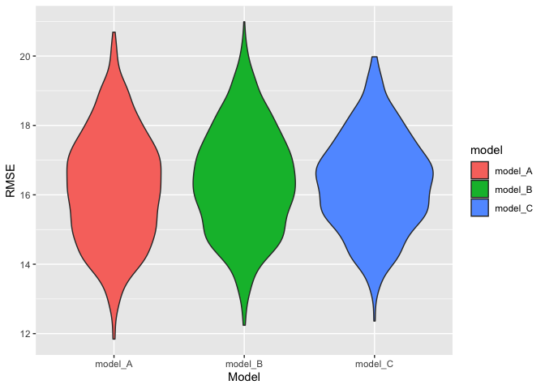<!-- -->

``` r
plot_mod_leverage(model_B)
```

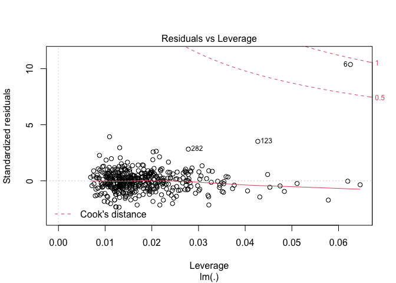<!-- -->

``` r
plot_mod_leverage(model_C)
```

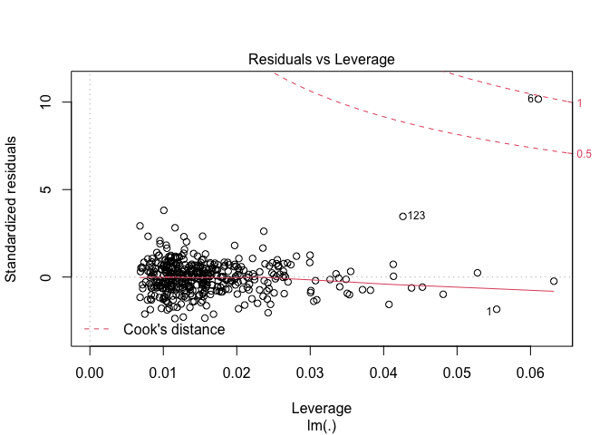<!-- -->

No wonder we had those weird distributions of RMSE in the Monte Carlo
simulations - we had a serious outlier. Let’s remove it and refit and
re-validate the models.

``` r
cdi_2 <- cdi %>% slice(-6)
# Get each model's adjusted r-squared
map(model_list, get_mod_adj_r_squared, data = cdi_2) %>%
  as_tibble() %>%
  pivot_longer(model_A:model_C,
               names_to = "model",
               values_to = "adj_r_squared") %>%
  arrange(desc(adj_r_squared)) %>%
  knitr::kable()
```

| model    | adj\_r\_squared |
|:---------|----------------:|
| model\_A |       0.5779819 |
| model\_B |       0.5723062 |
| model\_C |       0.5682312 |

``` r
# Perform cross validation for each model
map(model_list, get_cv_rmse, data = cdi_2) %>%
  as_tibble() %>%
  pivot_longer(model_A:model_C,
               names_to = "model",
               values_to = "RMSE") %>%
  arrange(RMSE) %>%
  ggplot(aes(x = model, y = RMSE, fill = model)) +
  geom_violin() + labs(x = "Model", y = "RMSE")
```

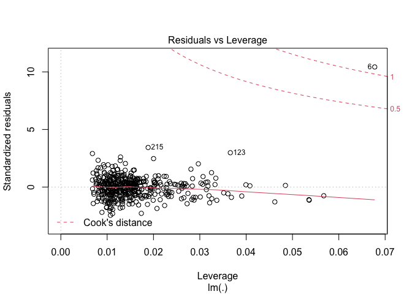<!-- -->

``` r
#Residual plots
plot_model_residuals(model_A, data = cdi_2)
```

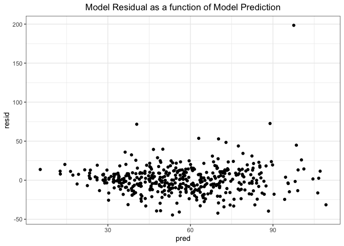<!-- -->

``` r
plot_model_residuals(model_B, data = cdi_2)
```

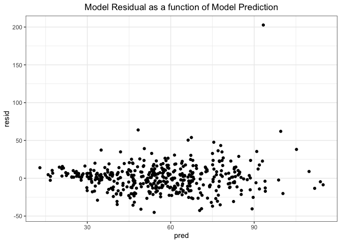<!-- -->

``` r
plot_model_residuals(model_C, data = cdi_2)
```

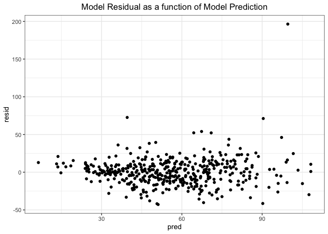<!-- -->

``` r
#Q-Q plots
plot_mod_qq(model_A, data = cdi_2)
```

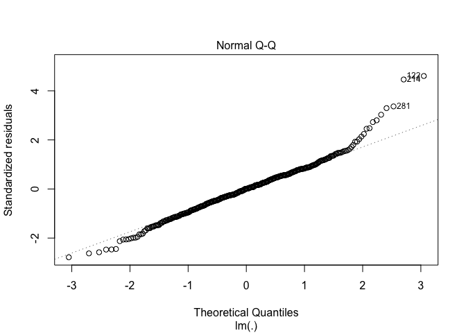<!-- -->

``` r
plot_mod_qq(model_B, data = cdi_2)
```

<!-- -->

``` r
plot_mod_qq(model_C, data = cdi_2)
```

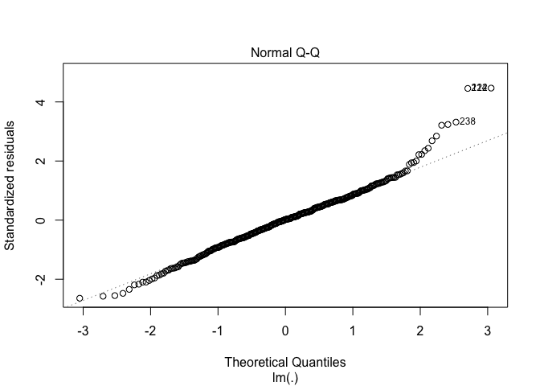<!-- -->

``` r
#Leverage plots
plot_mod_leverage(model_A, data = cdi_2)
```

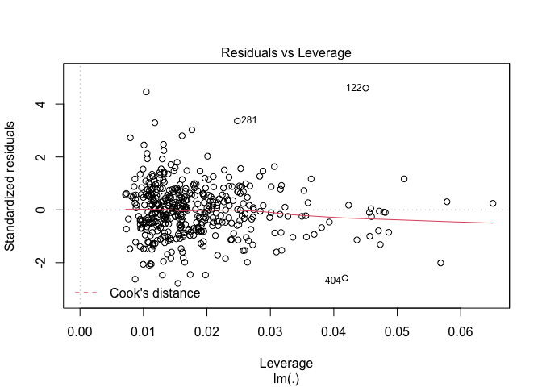<!-- -->

``` r
plot_mod_leverage(model_B, data = cdi_2)
```

<!-- -->

``` r
plot_mod_leverage(model_C, data = cdi_2)
```

<!-- -->

For reasons listed in the paper, we will use model C. Let’s summarize
the model.

``` r
broom::tidy(lm(model_C, data = cdi_2)) %>%
  knitr::kable()
```

| term                |   estimate | std.error |  statistic |  p.value |
|:--------------------|-----------:|----------:|-----------:|---------:|
| (Intercept)         | -98.510093 |  9.181019 | -10.729756 | 0.00e+00 |
| regionNorth Central |  11.058492 |  2.298291 |   4.811615 | 2.10e-06 |
| regionSouth         |  25.572291 |  2.235019 |  11.441643 | 0.00e+00 |
| regionWest          |  18.224954 |  2.786970 |   6.539343 | 0.00e+00 |
| log\_pop\_density   |   4.555372 |  1.104612 |   4.123956 | 4.47e-05 |
| log\_totalinc       |   8.316132 |  1.386287 |   5.998855 | 0.00e+00 |
| log\_poverty        |  21.188450 |  1.605139 |  13.200384 | 0.00e+00 |
