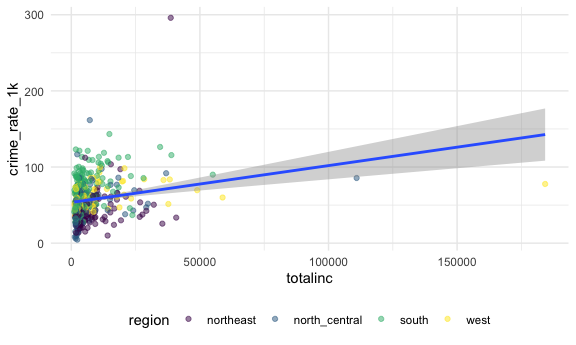

SLR Plots
================
Louis Sharp
11/17/2021

``` r
library(tidyverse)
library(patchwork)

knitr::opts_chunk$set(
  fig.width = 6,
  fig.asp = .6,
  out.width = "90%"
)

theme_set(theme_minimal() + theme(legend.position = "bottom"))

options(
  ggplot2.continuous.colour = "viridis",
  ggplot2.continuous.fill = "viridis"
)

scale_colour_discrete = scale_colour_viridis_d
scale_fill_discrete = scale_fill_viridis_d
```

``` r
cdi_df = read_csv("./data/cdi.csv") %>% 
  mutate(crime_rate_1k = (crimes/pop)*1000) %>% 
  relocate(crime_rate_1k, .before = id) %>% 
  mutate(region = as.factor(region),
         region = fct_recode(region, "northeast" = "1", "north_central" = "2",
                             "south" = "3", "west" = "4"))
```

``` r
cdi_df %>% 
  ggplot(aes(x = area, y = crime_rate_1k)) +
  geom_point(aes(color = region), alpha = 0.5) +
  geom_smooth(method = lm)
```

    ## `geom_smooth()` using formula 'y ~ x'


``` r
cdi_df %>% 
  ggplot(aes(x = pop, y = crime_rate_1k)) +
  geom_point(aes(color = region), alpha = 0.5) +
  geom_smooth(method = lm)
```

    ## `geom_smooth()` using formula 'y ~ x'


``` r
cdi_df %>% 
  ggplot(aes(x = pop18, y = crime_rate_1k)) +
  geom_point(aes(color = region), alpha = 0.5) +
  geom_smooth(method = lm)
```

    ## `geom_smooth()` using formula 'y ~ x'


``` r
cdi_df %>% 
  ggplot(aes(x = pop65, y = crime_rate_1k)) +
  geom_point(aes(color = region), alpha = 0.5) +
  geom_smooth(method = lm)
```

    ## `geom_smooth()` using formula 'y ~ x'


``` r
cdi_df %>% 
  ggplot(aes(x = docs, y = crime_rate_1k)) +
  geom_point(aes(color = region), alpha = 0.5) +
  geom_smooth(method = lm)
```

    ## `geom_smooth()` using formula 'y ~ x'


``` r
cdi_df %>% 
  ggplot(aes(x = beds, y = crime_rate_1k)) +
  geom_point(aes(color = region), alpha = 0.5) +
  geom_smooth(method = lm)
```

    ## `geom_smooth()` using formula 'y ~ x'


``` r
cdi_df %>% 
  ggplot(aes(x = hsgrad, y = crime_rate_1k)) +
  geom_point(aes(color = region), alpha = 0.5) +
  geom_smooth(method = lm)
```

    ## `geom_smooth()` using formula 'y ~ x'


``` r
cdi_df %>% 
  ggplot(aes(x = bagrad, y = crime_rate_1k)) +
  geom_point(aes(color = region), alpha = 0.5) +
  geom_smooth(method = lm)
```

    ## `geom_smooth()` using formula 'y ~ x'


``` r
cdi_df %>% 
  ggplot(aes(x = unemp, y = crime_rate_1k)) +
  geom_point(aes(color = region), alpha = 0.5) +
  geom_smooth(method = lm)
```

    ## `geom_smooth()` using formula 'y ~ x'


``` r
cdi_df %>% 
  ggplot(aes(x = pcincome, y = crime_rate_1k)) +
  geom_point(aes(color = region), alpha = 0.5) +
  geom_smooth(method = lm)
```

    ## `geom_smooth()` using formula 'y ~ x'


``` r
cdi_df %>% 
  ggplot(aes(x = totalinc, y = crime_rate_1k)) +
  geom_point(aes(color = region), alpha = 0.5) +
  geom_smooth(method = lm)
```

    ## `geom_smooth()` using formula 'y ~ x'



``` r
cdi_df %>% 
  ggplot(aes(x = region, y = crime_rate_1k)) +
  geom_point(aes(color = region), alpha = 0.5) +
  geom_smooth(method = lm)
```

    ## `geom_smooth()` using formula 'y ~ x'


``` r
cdi_df %>% 
  ggplot(aes(x = poverty, y = crime_rate_1k)) +
  geom_point(aes(color = region), alpha = 0.5) +
  geom_smooth(method = lm)
```

    ## `geom_smooth()` using formula 'y ~ x'


``` r
lm(crime_rate_1k ~ poverty, data = cdi_df) %>% 
  summary()
```

    ## 
    ## Call:
    ## lm(formula = crime_rate_1k ~ poverty, data = cdi_df)
    ## 
    ## Residuals:
    ##     Min      1Q  Median      3Q     Max 
    ## -64.008 -14.578  -2.561  13.605 208.853 
    ## 
    ## Coefficients:
    ##             Estimate Std. Error t value Pr(>|t|)    
    ## (Intercept)  33.1390     2.4435   13.56   <2e-16 ***
    ## poverty       2.7690     0.2472   11.20   <2e-16 ***
    ## ---
    ## Signif. codes:  0 '***' 0.001 '**' 0.01 '*' 0.05 '.' 0.1 ' ' 1
    ## 
    ## Residual standard error: 24.12 on 438 degrees of freedom
    ## Multiple R-squared:  0.2226, Adjusted R-squared:  0.2209 
    ## F-statistic: 125.4 on 1 and 438 DF,  p-value: < 2.2e-16

``` r
cdi_df %>% 
  ggplot(aes(x = hsgrad, y = poverty)) +
  geom_point(aes(color = region), alpha = 0.5) +
  geom_smooth(method = lm)
```

    ## `geom_smooth()` using formula 'y ~ x'


``` r
cdi_df %>% 
  ggplot(aes(x = bagrad, y = poverty)) +
  geom_point(aes(color = region), alpha = 0.5) +
  geom_smooth(method = lm)
```

    ## `geom_smooth()` using formula 'y ~ x'


``` r
cdi_df %>% 
  ggplot(aes(x = pcincome, y = poverty)) +
  geom_point(aes(color = region), alpha = 0.5) +
  geom_smooth(method = lm)
```

    ## `geom_smooth()` using formula 'y ~ x'


